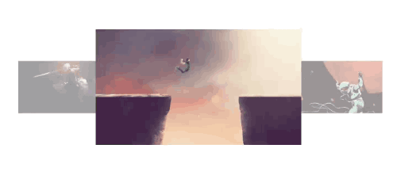

# GalleryViewPager

7 行 ViewPager.Transformer 代码让 ViewPager 有 3D Gallery 效果

### 效果



### 代码

```java
public class GalleryTransformer implements ViewPager.PageTransformer {
    @Override
    public void transformPage(View view, float position) {
        float scale = 0.5f;
        float scaleValue = 1 - Math.abs(position) * scale;
        view.setScaleX(scaleValue);
        view.setScaleY(scaleValue);
        view.setAlpha(scaleValue);
        view.setPivotX(view.getWidth() * (1 - position - (position > 0 ? 1 : -1) * 0.75f) * scale);
        view.setElevation(position > -0.25 && position < 0.25 ? 1 : 0);
    }
}
```

### 说明

1. 为了让中间的 Page 显示在最上层使用了 Elevation 只在 API 21 以上有效
2. ViewPager 循环借用了 [InfiniteViewPager](https://github.com/antonyt/InfiniteViewPager) 实现
3. 参考了项目 [MagicViewPager](https://github.com/hongyangAndroid/MagicViewPager)

### 许可

MIT
